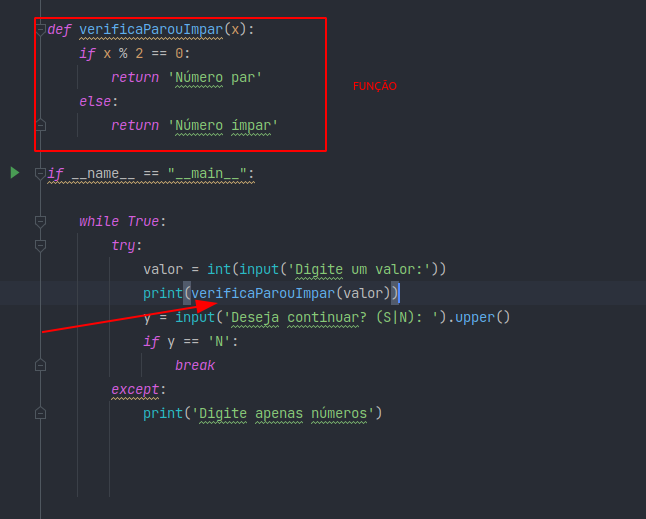
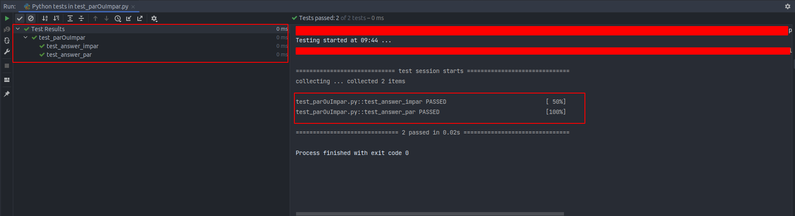

# Method Replace Inline Code with Function Call

🎓 College: [Faculdade Metodista Granbery](http://granbery.edu.br/)

👨‍🏫 Teacher: [Marco Antônio - Github](https://github.com/marcoaparaujo) | [Linkedin](https://www.linkedin.com/in/marco-ant%C3%B4nio-ara%C3%BAjo/)

📗 Book: [Refatoração - Aperfeiçoando o design de códigos existentes - Martin Fowler](https://www.amazon.com/-/pt/dp/B087N8LKYB/ref=sr_1_1?__mk_pt_BR=%C3%85M%C3%85%C5%BD%C3%95%C3%91&crid=M4T29CCKD30E&keywords=refatora%C3%A7%C3%A3o&qid=1651322207&sprefix=refatora%C3%A7%C3%A3o%2Caps%2C203&sr=8-1)

> FOWLER, Martin. “Replace Inline Code WIth Function Call” no código. *In*: REFATORAÇÃO: Aperfeiçoando o design de códigos existentes. 2. ed. [*S. l.*: *s. n.*], 2019. cap. 8.
> 

## Método

O método substituir código internalizado por chamada de função ( **Replace Inline Code with Function Call**), demostra as funções como melhorias de códigos. Com o decorrer do desenvolvimento do software, acabamos criando códigos repetidos que trazem o mesmo resultado. Talvez nem prejudique o software, mas com as manutenções no decorrer do tempo do software pode ocorrer pode trazer dificuldades para alterar tantos códigos repetidos do mesmo resultado. Esse método melhora o código tendo que criar uma função, essa função vai se transformar em apenas um código para que não necessite ficar repetindo várias vezes. Como Martin Fowler fala no livro, iremos empacotar o código para dentro dessa função. Nos locais que possui o Código repetido vamos apenas chamar a função.  

## Código

O código que estou usando para exemplo, é um código do meu repositório. Que tem objetivo de verificar o valor de entrada e retorna se é impar ou par. [CODE](https://github.com/DevEddi/project_even_or_odd_python)

## Procedimento

- Substitua o código internalizado por uma chamada á função existente.
- Teste

## Ferramenta para teste

### PyTest

```bash
    pip install ipytest
```

## Objetivo da atividade

1. Elabore ou escolha um código que a refatoração possa ser aplicada.
2. Identifique o mau cheiro associado.
3. Escreva os casos de teste e execute
4. Aplique a refatoração
5. Execute os casos de teste novamente
6. Documente cada etapa para a apresentação

## Mau Cheiro

### Código Duplicado

O mau cheiro que encontrei dentro do código abaixo foi o código duplicado, nós como desenvolvedores acabamos criando repetições de códigos sem a necessidade. Podendo prejudicar o código para manutenções, exigindo tempo para procurar a expressão que está repetida. 

## Código antigo

Você pode visualizar como existe a repetição.


## Código novo aplicando a refatoração

Agora observe a criação da função  sendo utilizada para chamar  a lógica apenas uma vez.



## Realização dos Testes

