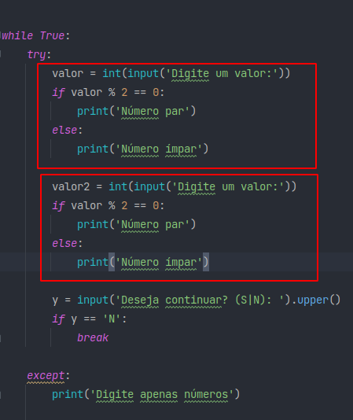

# Method Replace Inline Code with Function Call

🎓 College: [College Methodist Granbery](http://granbery.edu.br/)

👨‍🏫 Teacher: [Marco Antônio - Github](https://github.com/marcoaparaujo) | [Linkedin](https://www.linkedin.com/in/marco-ant%C3%B4nio-ara%C3%BAjo/)

📗 Book: [Refatoração - Aperfeiçoando o design de códigos existentes - Martin Fowler](https://www.amazon.com/-/pt/dp/B087N8LKYB/ref=sr_1_1?__mk_pt_BR=%C3%85M%C3%85%C5%BD%C3%95%C3%91&crid=M4T29CCKD30E&keywords=refatora%C3%A7%C3%A3o&qid=1651322207&sprefix=refatora%C3%A7%C3%A3o%2Caps%2C203&sr=8-1)

> FOWLER, Martin. “Replace Inline Code WIth Function Call” no código. *In*: REFATORAÇÃO: Aperfeiçoando o design de códigos existentes. 2. ed. [*S. l.*: *s. n.*], 2019. cap. 8.
> 

## Method

The method replace internalized code with function call ( **Replace Inline Code with Function Call**), demonstrates functions as code improvements. As the software develops, we end up creating repeated codes that bring the same result. It may not even harm the software, but maintenance over time can cause difficulties in changing so many codes that produce the same result. This method improves the code by having to create a function, this function will become just one code so that it does not need to be repeated several times. As Martin Fowler says in the book, we will package the code into this function. In places where the Code is repeated, we will just call the function.

## Code

The code I am using for example is code from my repository. Which aims to check the input value and returns whether it is odd or even. [CODE](https://github.com/DevEddi/project_even_or_odd_python)

## Procedure

- Replace the internalized code with an existing function call.
- Test

## Test tool

### PyTest

```bash
     pip install ipytest
```

## Objective of the activity

1. Design or choose a code that refactoring can be applied to.
2. Identify the associated bad smell.
3. Write the test cases and execute
4. Apply refactoring
5. Run the test cases again
6. Document each step for the presentation

## Bad smell

### Duplicate Code

The bad smell I found within the code below was duplicated code, as developers we ended up creating unnecessary code repetitions. This could harm the code for maintenance, requiring time to search for the repeated expression.

## Old code

You can visualize how there is repetition.



## New code applying refactoring

Now observe the creation of the function being used to call the logic just once.


## Testing


